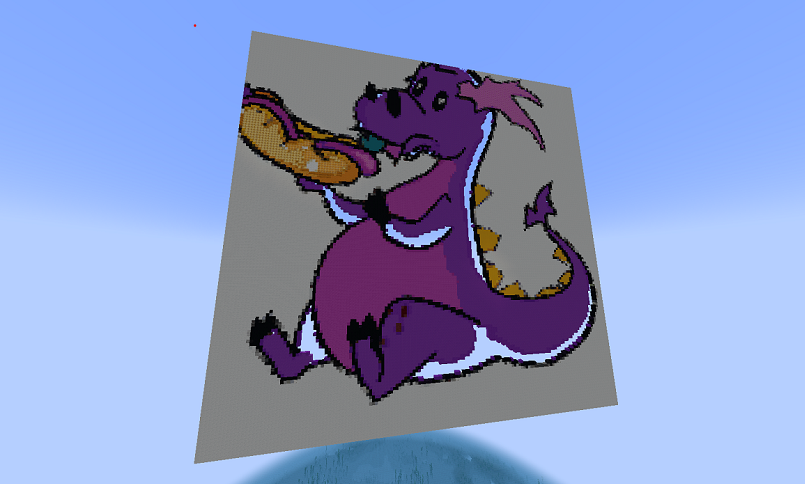

# ai-pixelart-mc-plugin

A Minecraft plugin that creates a PixelArt out of a prompt.



# Motive

This plugin requires payment, it isn't necessarily meant to be used widely by MC players, but to give inspiration to
MC plugin developers by a simple combination of two complex factors - AI image generation and PixelArt.

# Prerequisites

Must have a CraftBukkit MC server (1.20.1=<).
Must install [PixelPainter](https://www.spigotmc.org/resources/pixel-painter.104770) plugin and place it in
the plugins folder of the server.
Must have an API Key of [ChatGPT](https://platform.openai.com/).

# Get Started

Install the zip file and extract it.
If any changes has been made in the code, run this project in your IDE as a Maven package (in Eclipse, 'maven install') 
and create a folder 'ai-pixelart-mc-plugin', and create in it a file named 'config.yml' with the api key:
````bash
api_key=yourkey
````

Put the artifact(s) in the plugins folder of the server.
Start the server, open it in MC and run your command.

An example for such a command:

``` bash
/aipa prompt "purple dragon eats a hotdog" n 150
```

For commands specification, see the code (very simple).